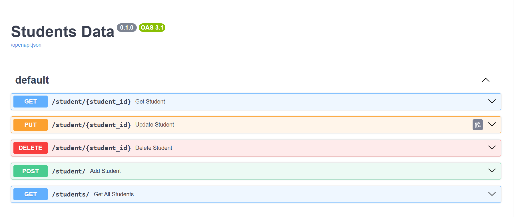

# FastAPI Student CRUD API

Student CRUD REST API built with FastAPI, SQLAlchemy and SQLite. Developed as part of my DecodeLabs Backend Development Internship.
## Features

- Create a student
- Retrieve a student by ID
- Retrieve all students
- Update student information
- Delete a student
- Prevent duplicate registration numbers
- SQLite database persistence
- SQLAlchemy ORM
- Pydantic data validation
- HTTP error handling
- Interactive Swagger API documentation

## Technologies

- **Python**
- **FastAPI** — REST API framework
- **SQLAlchemy** — ORM for database interaction
- **SQLite** — Relational database
- **Pydantic** — Request and response validation
- **Uvicorn** — ASGI server
## Database Model

  
| Field | Type | Description |
|---|---|---|
| `id` | Integer | Primary key |
| `name` | String | Student name |
| `dept` | String | Student department |
| `reg_no` | String | Unique registration number |
## API Endpoints

| Method | Endpoint | Description |
|---|---|---|
| POST | `/student/` | Create a new student | 
| GET | `/student/{student_id}` | Get a student by ID | 
| GET | `/students/` | Get all students | 
| PUT | `/student/{student_id}` | Update a student |
| DELETE | `/student/{student_id}` | Delete a student |

## Database

The project uses SQLite with SQLAlchemy ORM for database integration and persistent storage.

The database file is automatically created when the application starts for the first time, then it loads the data everytime.

## Running the Project

Install the dependencies:

```bash
pip install -r requirements.txt
```
## API Documentation

The API includes interactive Swagger documentation:


